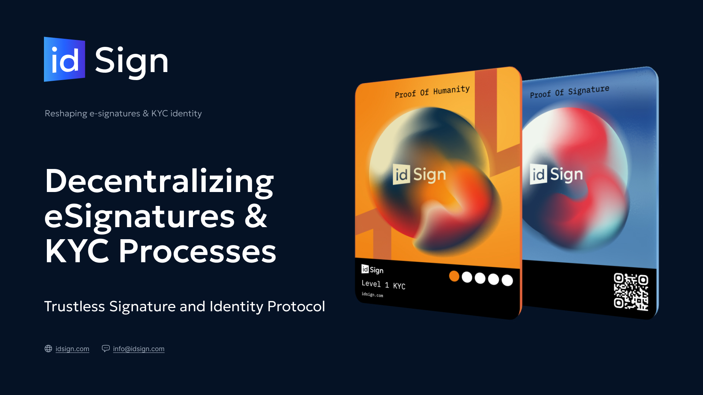

# Quick Start 

---

---
## Value Proposition
idSign is not just another e-signature platform—it's a leap into a future where your digital identity is in your control. By turning signatures into tamper-proof, immutable records on the blockchain and transforming KYC from a recurring hassle into a reusable one-time process, idSign addresses the critical needs of governments, corporations, and beyond.

**Why idSign?**
Unlock Efficiency: Streamline business operations with a one-time KYC that you can use across platforms, eliminating repetitive verifications.
Protect Privacy: Take control of your data with decentralized, blockchain-based solutions that reduce risk and fortify privacy.
Prove Authenticity: Every signature on idSign is more than a scribble—it's a proof of your identity and intent, locked on-chain for unparalleled security.

**Who We Serve**
idSign goes beyond Web3, tapping into traditional finance, enterprises, and any business that values security and simplicity. As the first real-world utility of Web3 in a SaaS model, we’re setting a new standard for digital signatures and identity verification.

**The Future of Digital Signatures**
The demand for secure online signatures is exploding as remote work and digital transactions become the norm. But with this growth comes the challenge of rising cyber threats. idSign stands at the forefront, providing an innovative, reliable solution to safeguard your digital transactions.

**Our Vision**
At idSign, we’re not just transforming signatures and identity verification—we’re redefining digital trust. With a solid go-to-market strategy, strategic partnerships, and an ambitious roadmap, including features like decentralized escrow and automated online agreements, we're poised to capture significant market share and redefine the future of digital business.

