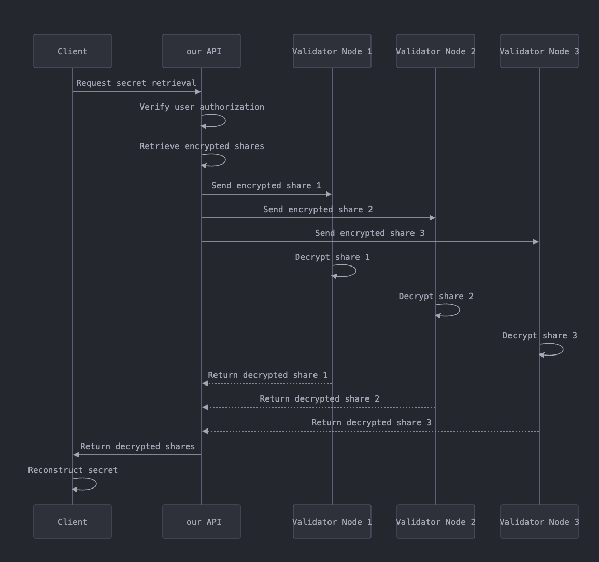
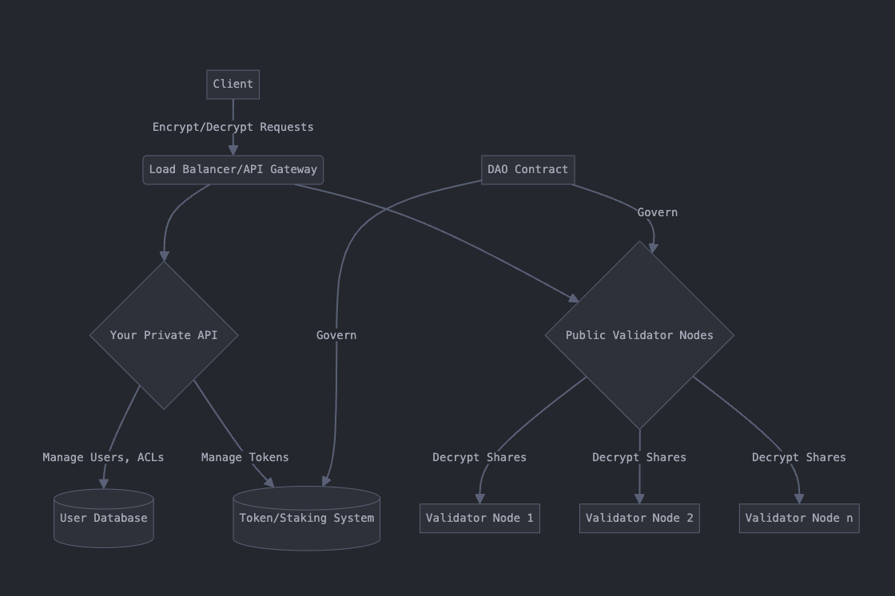

# MPCvaults

## Why Decentralized Storage?
**Unmatched Security with Layer 3 MPC:** Our advanced Layer 3 MPC network encrypts your data and splits it into fragments across multiple nodes, making unauthorized access virtually impossible. Only you and your selected wallets can reassemble and decrypt the information, ensuring your privacy is always preserved.

**Zero Trust Architecture:** At idSign, we operate on a zero-trust model. This means that no single party, not even idSign, can access your complete data set. By decentralizing storage and utilizing cutting-edge MPC technology, we eliminate the risk of centralized breaches and unauthorized access, providing you with true data sovereignty.

**Personalized Access Control:** Your data, your rules. With idSign, you can decide exactly who gets access to your information. Share securely with specific wallets, set permissions, and maintain full control over your data’s accessibility at all times.

## Built for the Future of Digital Privacy
Our decentralized storage solution is designed to meet the stringent demands of enterprises, governments, and individuals who prioritize privacy and security. By leveraging our Layer 3 MPC network, idSign sets a new standard for data protection, making centralized vulnerabilities and data leaks a thing of the past.

## A New Horizon for Secure Data Management
From sensitive business documents to personal identity information, idSign’s decentralized storage is built to handle the most critical data with the highest level of security. As we expand our platform, our vision is to provide a secure, scalable foundation for all digital interactions, driving a future where data privacy is not just a promise but a guarantee.

Own your data. Experience the ultimate in security and privacy with idSign’s Layer 3 MPC Decentralized Storage.

---

### **Components**:

### **Use Cases:**

- End-to-end Encrypted on-chain messaging
- Decentralized file-sharing (sharing the decryption key of an encrypted file stored on IPFS)
- Sharing information privately between DAO members
- Token-Gating without relying on a server to “Gate” the resource or the key to the resource
- Many more…
