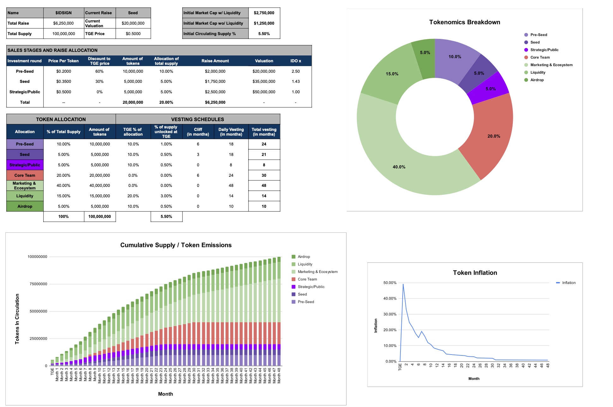
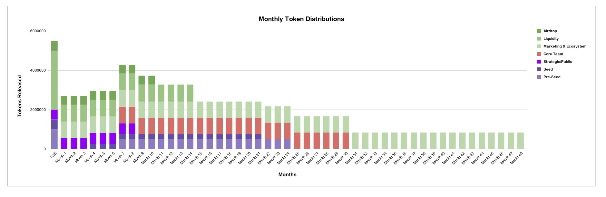
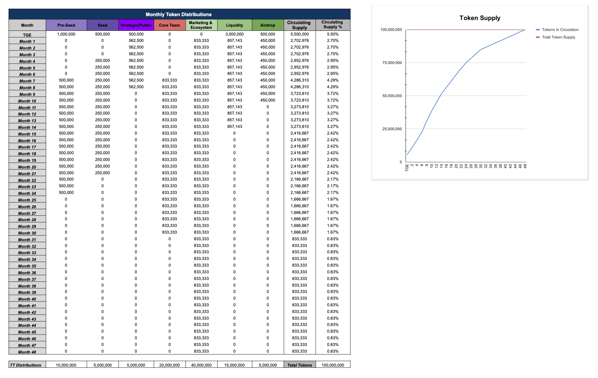

# Tokenomics Draft 

idSign is a decentralized e-signature & identity protocol revolutionizing digital trust by abstracting signatures into tamper-proof, immutable records on the blockchain, and transforming KYC from a recurring hurdle into a reusable one-time process, addressing the acute needs of governments and large corporations for stringent data privacy.

The $IDSIGN token is central to our ecosystem, offering users enhanced features, subscription upgrades, and cost savings. This document outlines the tokenomics of $IDSIGN, detailing its allocation, utility, and vesting schedules to ensure long-term sustainability and growth.

## **1. Supply and Allocation**

- **Total Supply:** 100 million $IDSIGN tokens, with no possibility for minting additional tokens.
- **Allocation:**
    - **Investors:** 20% (20 million $IDSIGN)
        - Private Pre-Sale Round: 10 million $IDSIGN at a $20 million valuation ($0.2/token)
        - Other Strategic Rounds: 5 million $IDSIGN at a $__ million valuation ($0.__/token)
        - Post-Launch Round: 5 million $IDSIGN at a $__ million valuation ($0.__/token)
    - **Team and Advisors:** 20% (20 million $IDSIGN)
    - **Market Liquidity & Exchanges:** 60% (60 million $IDSIGN)

## **2. Token Launch Strategy**

- A pre-sale will offer early supporters a chance to buy $IDSIGN at a discounted rate, with a defined cap to ensure wide distribution.
- The public sale will follow, establishing initial market liquidity and valuation for $IDSIGN.
- $IDSIGN aims to be listed on Tier1 exchanges to ensure accessibility and liquidity for a broad audience.

## **3. Vesting Schedules**

- **Team:** 24-month vesting with a 6-month cliff, aligning long-term interests.
- **Investors:** 18-month vesting with a 3-month cliff, recognizing their contribution to project development and strategy.

## **4. Technical Specifications**

- **Blockchain Platform:** Ethereum
- **Token Standard:** ERC-20, ensuring interoperability and security.

## **5. Token Utility & Staking**

- **Pro Subscription Unlock:** Staking 100+ $IDSIGN tokens unlocks the Pro subscription model with advanced features.
- **Commission Discounts:** Tokens entitle users to discounts on the 5% escrow payment fee, scaled by the amount of $IDSIGN held.

## **6. Governance & DAO**

- Governance: Voting on snapshot for decesion making
- DAO: Mediation and MPC nodes

## **7. Project Roadmap**

Our platform leverages the decentralized nature of blockchain technology to reduce risk, protect privacy, and solidifies authenticity. Storing and sharing the documents in a zero-knowlege and private way is our core focus at idSign. No one, not even us will have access to the files uploaded except the creator and the parties they shared it with. We achieve this using a new technology we developed leveraging MPC technology and Decentralized Key Management to successfully Token Gate access control rules of the files on the MPC blockchain instead of a centralized API like most projects do!

 **Modules:**

A. Decentralized e-Signature Protocol (Dynamic on-chain SBT Proof-of-Signature)

B. TRUE Decentralized Token-Gating using MPC Key Management System

> A New system we are building that leverages Multi-Party Computation Blockchain and ZK-SmartContracts to create Access Control Lists on the uploaded files and share access of the encryption key Through the MPC blockchain. Files will be Stored on a Decentralized storage and only be accessible by the owner and parties they share it with. Even idSign employees can Never decrypt user files.
> 

C. Social Logins & Sponsored Free Transactions

D. On-Chain Reusable Identity (Dynamic on chain SBT KYC)

### Milestone **Alpha v0.1.x ✅**

- Frontend: Landing Page + Blogs
- DApp: Wallet Login and Magic Email Wallet generation (for onboarding web2 users easily)
- DApp: Dashboard structure
- DApp: Create agreement & Send Signature Requests
- Smart-Contract: DDSP (Decentralized Digital Signature Protocol) for Proof-Of-Signature (On-Chain Dynamic Non-Transferable NFT)
- API: Encrypted Zero-Knowledge Decentralized Document Storage for Agreement PDFs

### **Milestone Alpha v0.2.x 🔁**

- Smart-Contract: Testing & Auditing D.D.S.P smart-contract
- DApp: Signature Page (Token-Gated Access)
- Proof of Humanity KYC Token
- Full KYC process
- Reusable KYC

### **Milestone Beta v0.3.x 🕘**

- Decentralized Escrow Payment Protocol (Proof of Funds Escrowed) for adding a Payment Provider on top of DDSP Agreement
- API: Adding Mediator (Lawyer, Middleman, Inspector) to Validate that the terms of an agreement has been met and release funds
- Pay in StableCoins (USDC, USDT, BUSD, DAI) or BinancePay

### **Future Plans 🚀**

- A.I. Mediation: We plan to add A.I. integrations to help users create templates, explain agreements and give recommendations on mediation.
- Team Business Plans: We plan to add support for Teams in a web3-native way using multi-sig wallets. This will allow businesses to add their employees to the dashboard and perform actions on their behalf while still insuring security and authorization signatures from multiple Executives in the company before approving any action.
- Smart Agreements: We plan to add support for “Smart” Agreements that allows users to create functional scripts and flows that will be automatically invoked on-chain. This will improve trust even more and might help eliminate scam projects and protect investors. An example would be for an ICO project to create a SmartAgreement that will launch a private sale then after a specified set time automatically generate the Token, add liquidity and distribute allocations giving the project’s investors a real trustless experience of the project’s roadmap!
- Decentralized Escrow Payments
- Web3-native Subscription Plans for Teams (using multi-sig account abstraction smart wallets)
- A.I. Tools and Templates
- Apps and Plugins Integrations Marketplace (Hubspot, Google workspace, Microsoft, etc.)
- Login with idsign SDKs and APIs

## 8. SAAS Model & Escrow Revenue Model Financials

| Profit & Loss Statement | Year 1 | Year 2 | Year 3 | Year 4 | Year 5 |
| --- | --- | --- | --- | --- | --- |
| Total Revenues | 877,600.00 | 2,053,584.00 | 3,982,197.76 | 7,145,124.33 | 12,332,323.90 |
| Cost of goods sold (COGS) | (35,000.00) | (57,400.00) | (94,136.00) | (154,383.04) | (253,188.19) |
| Gross profit | 842,600.00 | 1,996,184.00 | 3,888,061.76 | 6,990,741.29 | 12,079,135.71 |
| Operating Expenses | (368,000.00) | (386,400.00) | (405,720.00) | (426,006.00) | (447,306.30) |
| Salaries | (432,000.00) | (453,600.00) | (476,280.00) | (500,094.00) | (525,098.70) |
| Earning before Taxes (EBT) | 42,600.00 | 1,156,184.00 | 3,006,061.76 | 6,064,641.29 | 11,106,730.71 |
| Taxes (0%) | 0.00 | 0.00 | 0.00 | 0.00 | 0.00 |
| Net Profit | 42,600.00 | 1,156,184.00 | 3,006,061.76 | 6,064,641.29 | 11,106,730.71 |

(full financials available on demand)

## 9. FAQs

1. **Differentiation**:
    
    Q: DocuSign is a well-established player in the market. What differentiates idSign from DocuSign and other competitors? What's the unique value proposition?
    
    A: idSign offers a unique immutable on-chain proofs that not only captures signatures but also acts as real digital-proof of the signer, ensuring a higher level of privacy and security due to our decentralized Zero-Knowledge Storage with token-gated access to agreements. Additionally, our platform integrates seamlessly with a broader range of third-party applications compared to our competitors allowing users to re-use their identity KYC.
    
2. **Go-to-Market Strategy**:
    
    Q: How do you plan to capture 10% of DocuSign's client base? What's the strategy in place to achieve this?
    
    A: We plan to leverage the founders' existing connections in the industry to establish partnerships and integrations. Additionally, we'll be offering a limited-time discounted rate for early adopters, incentivizing them to switch from competitors like DocuSign.
    
3. **Product Development**:
    
    Q: What stage is the product currently in? Do you have a Minimum Viable Product (MVP)? Any traction or feedback from potential users?
    
    A: We have a functional MVP for our protocol that has been tested. The feedback has been overwhelmingly positive from partnerships Skale, Partisia, Alchemy, Polygon and Ethereum Foundation.
    
4. **Churn Rate and Customer Acquisition**:
    
    Q: In the SaaS model, customer acquisition cost (CAC) and churn rate are critical metrics. Do you have projections or strategies in place to manage these?
    
    A: We project a churn rate of 5% in the first year, which we aim to reduce to 3% by the third year through continuous product improvements and customer support. Our estimated customer acquisition cost (CAC) is $50, with a lifetime value (LTV) of $600, giving us a healthy LTV:CAC ratio.
    

## **10. Conclusion**

IDSign is set to revolutionize the way we think about digital signatures, identity verification, and escrow services by leveraging blockchain technology. The $IDSIGN tokenomics are designed to support this vision by incentivizing participation, ensuring platform growth, and aligning the interests of all stakeholders.

Our Deck: [https://docsend.com/view/6qe3smtut3xwsafy](https://docsend.com/view/6qe3smtut3xwsafy) 

Lets Get in Touch 👉 [https://calendly.com/idsign](https://calendly.com/idsign)