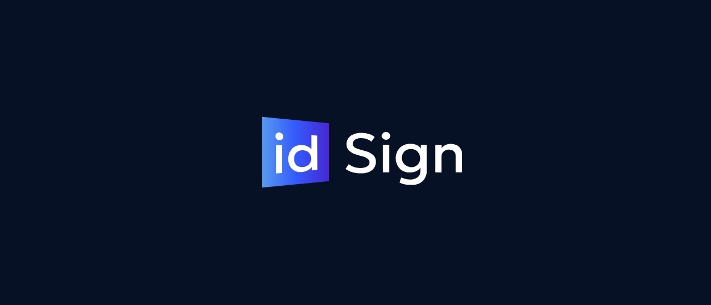

# Whitepaper v.0.1.0

---

---

## Abstract

idSign is a pioneering Trustless Signature & Identity Protocol that leverages the power of decentralized blockchain technology, enabling the effortless creation and signing of agreements while providing individuals with the ability to obtain reusable on-chain KYC token.

idSign is a groundbreaking startup offering a decentralized signature protocol and reusable identity protocol. Our solution provides a user experience similar to popular platforms like DocuSign but with the added advantage of decentralization, ensuring enhanced security, privacy, and trust-lessness.

Using our innovative protocol, we mint proof-of-signature wallet-bound tokens, establishing immutable evidence that parties have entered into a legally binding agreement on-chain. This approach eliminates the need for traditional intermediaries and introduces a higher level of transparency and immutability to the signing process.

To ensure the utmost security and privacy, we built a new Module zkShare that stores all documents encrypted on a decentralized storage platform called IPFS (InterPlanetary File System) with keyless MPC Zero-Knowledge encryption. We prioritize user privacy by never storing any of sensitive data and documents uploaded during the Agreement Sending and signing process. Users who complete the KYC process receive a proof-of-humanity token that is wallet-bound and non-transferable. These tokens are dynamic and can change states and levels depending on the progress and completion of their KYC process. With five levels of KYC tokens, users can showcase their identity verification status easily and securely. The KYC documents uploaded also are never stored on a centralized database and are only accessable using zkShare our DKMS module powered by ZK-MPC. 

Furthermore, our Identity SBT offers an additional advantage by allowing users to reuse them on various third-party exchanges or decentralized applications (dApps) that require KYC. By leveraging our tokens, users can avoid redundant KYC processes and enjoy a seamless and efficient onboarding experience across multiple platforms.

In a powerful combination of our signature protocol and KYC features, we enable users to send signature requests specifically to KYCed individuals, further streamlining the signing process and adding an extra layer of trust. This unique integration optimizes efficiency and eliminates potential bottlenecks or delays in the agreement execution process.

idSign is poised to revolutionize the way businesses and individuals handle signatures and identity verification. By leveraging blockchain technology, decentralization, and Zero-Knowledge principles, we provide a secure, private, and efficient solution that meets the growing demands of the modern digital economy.

## The Digital Trust Dilemma 

In a world where data is gold, who hold the keys to their privacy? Trust has become both a paramount concern and a significant bottleneck. Existing eSignature solutions and KYC processes are plagued by inefficiencies, centralized security vulnerabilities, and a lack of transparency, leading to a fragmented and distrustful digital landscape.

Problems:
- **Critical Data Vulnerabilities:** Centralized platforms are ticking time bombs for data breaches, exposing highly sensitive information to catastrophic leaks.
- **System Outage Catastrophes:** A single point of failure could paralyze operations, leaving transactions in limbo and eroding trust irreparably.
- As RWA tokenization gains momentum, centralized platforms are fundamentally ill-equipped. The unique demands of RWAs require flexible, tailored solutions addressing the wave of RWAs demands.
- Privacy Time Bomb in Centralized Platforms: Centralized eSignature platforms store sensitive documents and personal identity information on their servers risking unprecedented privacy violations. Whether through external cyber-attacks or internal malfeasance, the outcome is a profound breach of trust, exposing users to identity theft, financial loss, and irreparable damage to personal and professional reputations.

### Decentralized Signature

1. Lack of Transparency: Traditional signature processes often lack transparency, making it challenging to verify the authenticity and integrity of signed documents. This can lead to disputes and legal complications.
2. Centralized Control: Existing signature platforms are often centralized, relying on a single authority to manage and store signatures. This introduces vulnerabilities and reliance on third-party intermediaries.
3. Lack of Immutable Records: Without a decentralized system, signed documents can be susceptible to tampering or alteration, compromising their legal validity.

### Reusable Decentralized Identity

1. Redundant KYC Processes: Many individuals are required to complete the KYC process multiple times when onboarding onto various platforms or exchanges. This leads to user frustration, delays, and inefficiencies.
2. Data Privacy and Security Risks: Centralized KYC processes require individuals to share sensitive personal information with multiple entities, increasing the risk of data breaches and misuse.
3. Lack of User Control: Individuals have limited control over their KYC information once it is shared with centralized entities. This compromises privacy and increases dependence on intermediaries.

By addressing these problems, idSign offers a decentralized signature protocol that ensures transparency, immutability, and eliminates the need for centralized intermediaries. Additionally, the reusable decentralized KYC feature allows users to securely share their identity information without redundant processes and empowers them with control over their data.

## Solution Overview

idSign is an innovative startup that offers a decentralized signature protocol and decentralized KYC provider. Our comprehensive solution revolutionizes the way signatures are executed and identity verification is conducted, providing numerous benefits and ensuring enhanced security, privacy, and trust-lessness:
 - Security & Privacy: "Utilize encrypted, decentralized storage, ensuring that only authorized parties can access sensitive information."
 - Transparent & Verifiable Signatures: "Every signature is recorded on the blockchain, providing undeniable proof of agreement."
 - Reusable Identity: "Your digital ID can be securely reused, simplifying and streamlining the verification process across services."
 - Escrow Payments: "Link payments directly to agreements for secure, on-time transactions."

### Decentralized Signature Protocol
We introduce a decentralized signature protocol that eliminates the need for centralized intermediaries. By leveraging blockchain technology, we create a transparent and immutable system where signatures are securely stored on-chain. This ensures the authenticity and integrity of signed documents, mitigating the risk of disputes and legal complications.

### On-Chain Proof-of-Signature and Immutable Records
With idSign, parties involved in a signature process are issued wallet-bound tokens that serve as proof-of-signature. These tokens are minted on the blockchain, creating an indisputable and tamper-proof record of the agreement. By leveraging the decentralized nature of the blockchain, we eliminate the risk of alteration or manipulation, establishing a robust and immutable record of the signed document.

### Encrypted Document Storage using IPFS:
To ensure the utmost security and privacy, we built a new Module zkShare that stores all documents encrypted on a decentralized storage platform called IPFS (InterPlanetary File System) with keyless MPC Zero-Knowledge encryption. We prioritize user privacy by never storing any of sensitive data and documents uploaded during the Agreement Sending and signing process. Users who complete the KYC process receive a proof-of-humanity token that is wallet-bound and non-transferable. These tokens are dynamic and can change states and levels depending on the progress and completion of their KYC process. With five levels of KYC tokens, users can showcase their identity verification status easily and securely. The KYC documents uploaded also are never stored on a centralized database and are only accessable using zkShare our DKMS module powered by ZK-MPC. 

### Zero-Knowledge Solution for Privacy and Security
At idSign, privacy and security are paramount. Our solution incorporates Zero-Knowledge principles, allowing individuals to verify their identity and complete the KYC process without revealing sensitive personal information. This ensures that users have full control over their data, reducing the risk of data breaches and enhancing trust in the verification process. By combining these elements—a decentralized signature protocol, on-chain proof-of-signature, encrypted document storage, and a Zero-Knowledge solution — idSign offers a comprehensive platform that guarantees transparency, immutability, privacy, and security. Our solution enables businesses to streamline their signature processes, establish legally binding agreements, and protect their sensitive information. Additionally, individuals can conveniently complete KYC processes and reuse their verified identity across various platforms, enhancing efficiency and reducing redundancy.

## A Growing Demand for Digital Trust

### Market Size
- eSignature Market Size: The global eSignature market size was estimated to be around USD 2.8 billion in 2022 and is expected to reach USD 14.1 billion by 2026, growing at a CAGR of 38.2%

- SaaS (Software as a Service) Market Size: The global SaaS market size was valued at approximately USD 186 billion in 2022 and is projected to reach around USD 700 billion by 2030, growing at a CAGR of 18%

- Identity Market Size: The global identity verification market size was estimated at USD 9.87 billion in 2022 and is expected to grow at a compound annual growth rate (CAGR) of 16.7% from 2023 to 2030 (Grand View Research).

- Tokenization of Real World Assets (RWA) market is on a significant growth trajectory. Industry predictions indicate that by 2030, the market value could grow to between 4 trillion and 16 trillion dollars.

- SAAS escrow services market was valued at $5.4 billion in 2021, and is projected to reach $18.4 billion by 2031, growing at a CAGR of 13.4% from 2022 to 2031

The signature and KYC market are vital components of numerous industries, including finance, legal, real estate, and more. The traditional methods of signatures and KYC processes have faced challenges related to security, efficiency, and trust. However, the market is rapidly evolving, with a growing need for innovative solutions.

Multiple sources and research studies indicate a promising market potential for decentralized signature and KYC solutions:

- According to a report by “MarketsandMarkets”, the global digital signature market is expected to reach USD 14.1 billion by 2026, growing at a CAGR of 31.0% during the forecast period.
- The increasing adoption of blockchain technology across industries further validates the market potential. A report by Grand View Research suggests that the global blockchain technology market is projected to reach USD 72.1 billion by 2027, with multiple sectors, including finance and legal, embracing its potential.

These trends and projections highlight the immense market potential for idSign. As decentralized and trustless solutions gain traction, businesses and individuals are actively seeking alternatives that ensure security, privacy, and efficiency. With its innovative features and robust infrastructure, idSign is uniquely positioned to capture a significant share of the growing market demand.

By addressing the shortcomings of traditional signature and KYC processes, idSign stands at the forefront of an evolving market, ready to disrupt the industry and deliver a superior user experience. With increasing adoption and recognition of decentralized and trustless solutions, the market potential for idSign is projected to grow exponentially in the coming years.

### Increasing Demand for Decentralized and Trustless Solutions

There is a significant shift in market demand towards decentralized and trustless solutions for signatures and KYC processes. The shortcomings of centralized systems, such as lack of transparency, data breaches, and limited user control, have highlighted the need for a more secure and reliable approach. As businesses and individuals become more aware of these challenges, the demand for decentralized and trustless alternatives, like idSign continues to rise.

## Competitive Landscape

### Existing Signature and KYC Solutions

The signature and KYC market consists of both centralized and decentralized solutions. Some prominent players in the market include traditional platforms like DocuSign, HelloSign, and Adobe Sign, which offer centralized signature services. On the other hand, decentralized solutions such as Uport and SelfKey provide decentralized identity verification services.

### The Cost of Not Switching:
   - Financial Implications: Traditional eSignature solutions can be expensive due to their pricing models. The indirect costs from inefficiencies, such as the time spent on redundant KYC processes or dealing with the aftermath of security breaches, can add significantly to operational expenses.
   - Time Drain: The repetitive nature of conventional identity verification and document signing processes consumes a disproportionate amount of time, a resource that could be better spent on core business activities.
   - Security and Privacy Risks: Staying with platforms that centralize sensitive information invites security breaches and privacy invasions, leading to potential financial losses, reputational damage, and the incalculable cost of personal data exposure.

### Proven Market Need:
   Industry Validation: The shift towards decentralized solutions is not a trend but a response to a clear market need validated by the biggest players across industries. From finance to healthcare, leading sectors are moving towards blockchain for its security, transparency, and efficiency. idSign is at the forefront of this shift, offering a solution that has been tested and proven in the market.

### Unique Features and Advantages

idSign differentiates itself from competitors by offering a comprehensive solution that combines decentralized signature protocol and decentralized KYC features. Here are the key advantages and unique features of idSign:

1. Decentralized Signature Protocol:
    - On-chain Proof-of-Signature: Unlike centralized platforms, idSign mints proof-of-signature wallet-bound tokens on the blockchain, providing an immutable record of agreements.
    - Enhanced Transparency: The decentralized nature of the protocol ensures transparency in the signing process, minimizing the risk of disputes and ensuring trust among parties.
    - Immutable Document Storage: idSign securely stores signed documents using IPFS, a decentralized storage solution. This eliminates the vulnerabilities associated with centralized databases.
2. Decentralized KYC:
    - Reusable KYC Tokens: idSign offers wallet-bound KYC tokens that can be reused across multiple third-party exchanges or dApps, streamlining the KYC process and reducing redundancy for users.
    - Dynamic KYC Levels: The KYC tokens provided by idSign can change states and levels based on the user's KYC process. This allows for a flexible and adaptable identity verification system.
    - Zero-Knowledge Solution: idSign ensures privacy and security with its Zero-Knowledge approach, allowing individuals to verify their identity without revealing sensitive personal information.
3. zkShare:
    - Documents uploaded are never stored on our database nor any keys! Encryption and decryption happens through MPC nodes independently and is a part of the full Key. One key by itself is un-usable.  
    - Trustless Environment: With its decentralized nature, idSign eliminates the need for intermediaries, reducing reliance on trusted third parties and ensuring a trustless environment for all participants.

The combination of a decentralized signature protocol, on-chain proof-of-signature, encrypted document storage, reusable KYC tokens, dynamic KYC levels, and Zero-Knowledge solution sets idSign apart from its competitors. By offering a comprehensive and secure platform, idSign provides users with enhanced transparency, privacy, and control over their signature and KYC processes, giving it a competitive advantage in the market.

### Empowering Real World Assets (RWAs)
Imagine seamlessly tokenizing a piece of fine art or real estate, creating a digital representation that can be traded, owned fractionally, or used as collateral in the DeFi ecosystem. idSign revolutionizes this process by ensuring that agreements underlying these tokenizations are not only legally binding but also smart, executing automatically based on predefined conditions. Our platform ensures that every transaction, every tokenization of an RWA, is backed by secure, transparent, and immutable digital agreements."
  By leveraging idSign, users can:
  - Tokenize any RWA with confidence, knowing that the underlying agreements are secure and enforceable.
  - Access a new universe of investment opportunities, with the simplicity and security of Web2 but the power and flexibility of Web3.
  - Enjoy fractional ownership and increased liquidity in assets previously considered illiquid, such as real estate and fine art.

### Target Audience and Industries

The target audience for idSign includes:

1. Businesses of all sizes and industries: idSign caters to businesses that require secure and efficient digital signature solutions, such as finance and banking, legal and consulting services, real estate, healthcare, supply chain and logistics, human resources, and government agencies.
2. Professionals and Individuals: Freelancers, independent professionals, contractors, and individuals who need a reliable and user-friendly platform for digitally signing contracts, agreements, and other documents.
3. Enterprises and Organizations: idSign offers scalable solutions for enterprises and organizations that require advanced customization, team management features, and integration capabilities to streamline their signature and KYC processes.
4. Legal and Compliance Departments: Law firms, notaries, and compliance departments within organizations benefit from the secure and compliant signature and KYC solutions offered by idSign.
5. Government Agencies and Institutions: Public sector organizations, educational institutions, and government agencies can utilize idSign to enhance administrative processes, sign contracts, and streamline document workflows securely.

## What's Next for idSign
 In envisioning the long-shot future plans for idSign, we are poised to redefine the landscape of digital agreements and trust further by integrating cutting-edge artificial intelligence (AI) and decentralized decision-making processes. Our roadmap includes leveraging AI to revolutionize how users interact with and understand agreements. Before signing, AI will elucidate the contents and implications of agreements, ensuring users are fully informed and confident. Beyond comprehension, AI-driven template generation will streamline the creation of agreements, making them more accessible, efficient, and tailored to specific needs. In the realm of dispute resolution, we plan to introduce Smart Mediations—a pioneering approach where complex rules govern the mediation of agreement disputes. These disputes could be resolved through DAO member votes, embodying the essence of decentralized decision-making, or through sophisticated AI analyses, ensuring fairness and efficacy. This blend of AI and DAO for agreement mediation and problem-solving not only underscores our commitment to innovation but also enhances trust, security, and user empowerment in digital transactions.

## Business Model and Revenue Potential

Our revenue model is built on escrow transaction fees, subscription plans for enhanced features, and SDK mirco-transactions. This scalable approach is designed for long-term growth, with multiple channels for expansion and diversification.
Through idSign, RWAs can tap into the enormous potential of TradFi assets, bringing them into the DeFi world with enhanced security, transparency, and efficiency. This not only opens up new avenues for investment and asset utilization in the Web3 ecosystem but also paves the way for a more inclusive financial world where high-value assets are accessible to a broader range of investors

- Subscription Plans: idSign offers different subscription plans to cater to the diverse needs of its users. These plans include a free plan (with limited features), plus plan, business plan, and an enterprise plan.
- Pricing Tiers: The pricing tiers are designed to accommodate the varying requirements of users and organizations. Each plan offers different levels of features, such as document creation limits, signature transactions, KYC levels, document upload limits, template builders, AI builders, AML checks, team management, support, and additional services.
- Escrow Fees

The revenue potential is derived from the subscription fees paid by users for accessing the features and capabilities offered by idSign. As the user base expands and more organizations adopt idSign for their signature and KYC needs, the revenue will grow accordingly. idSign will focus on a robust marketing and sales strategy to capture a significant share of the market, leveraging its unique value proposition of decentralization, trustlessness, on-chain proof-of-signature, encrypted document storage, reusable KYC tokens, and Zero-Knowledge solutions.

By effectively penetrating the market and continuously improving its offerings, idSign has the potential to generate substantial revenue, becoming a leading player in the decentralized signature and KYC market.

##  Go-to-Market & KPIs

### January - May (Pre-Launch Phase)

- **Customer Acquisition Rate:** Increase waitlist sign-ups by 5-10% each month.
- **Churn Rate:** Not applicable.
- **MRR Growth Rate:** Not applicable.
- **CLV:** Not applicable.
- **CSAT:** Aim for 80%+ satisfaction from beta testers.
- **NPS:** Target a score of 30+ from beta testers.
- **Customer Engagement:** Not applicable.
- **ARPA:** Not applicable.
- **CAC:** Monitor and optimize to reduce during pre-launch marketing campaigns.
- **Conversion Rate (Free to Paid):** Not applicable.

### June (Launch Month)

- **Customer Acquisition Rate:** Target 100+ new customers.
- **Churn Rate:** Set a baseline, aim to keep under 5%.
- **MRR Growth Rate:** Establish baseline MRR.
- **CLV:** Establish baseline and aim for a 5% increase month-over-month subsequently.
- **CSAT:** Maintain or improve upon 85%+.
- **NPS:** Increase to 40+.
- **Customer Engagement:** Establish baseline metrics.
- **ARPA:** Establish baseline ARPA.
- **CAC:** Maintain a CAC:CLV ratio of at least 1:3.
- **Conversion Rate (Free to Paid):** Aim for a conversion rate of 2-5%.

### July - December (Post-Launch Phase)

- **Customer Acquisition Rate:** Increase new customer acquisition by 15-20% monthly.
- **Churn Rate:** Keep under 5%.
- **MRR Growth Rate:** Target 10-15% growth month-over-month.
- **CLV:** Increase by 5% month-over-month.
- **CSAT:** Maintain or improve upon 85%+.
- **NPS:** Aim to maintain or improve upon a score of 40+.
- **Customer Engagement:** Increase key feature usage by 10-15% monthly.
- **ARPA:** Increase by 5-10% monthly through upselling and feature additions.
- **CAC:** Continue optimizing to improve CAC:CLV ratio.
- **Conversion Rate (Free to Paid):** Improve upon the initial conversion rate, aiming higher as product value is proven.

### Marketing and Sales Strategy

To attract users and clients, idSign will employ a comprehensive go-to-market strategy that combines targeted marketing efforts and a proactive sales approach. The key components of the strategy include:

1. Market Segmentation: idSign will conduct extensive market research to identify target industries and customer segments that can benefit the most from decentralized signature and KYC solutions. This will enable focused marketing efforts tailored to specific needs and pain points.
2. Branding and Positioning: A strong brand image will be developed, emphasizing the core values of reliability, security, and trustlessness. idSign will position itself as a pioneer in the decentralized signature and KYC market, highlighting its unique features, such as on-chain proof-of-signature, encrypted document storage, and reusable KYC tokens.
3. Thought Leadership and Content Marketing: idSign will establish itself as an industry thought leader by creating high-quality content, such as blog posts, whitepapers, and case studies. This content will educate the target audience about the benefits of decentralized signature and KYC solutions and showcase idSign as an authority in the field.
4. Online Presence and SEO: A robust online presence will be developed, including a user-friendly website optimized for search engines. This will enable potential users and clients to easily discover and learn about idSign. Search engine optimization (SEO) techniques will be employed to increase organic visibility and drive targeted traffic to the website.
5. Partnerships and Integrations: idSign will forge strategic partnerships with complementary service providers and platforms, such as blockchain networks, document management systems, and identity verification services. These partnerships will help expand the reach and integration capabilities of idSign while offering added value to clients.
6. Customer Referral Program: A customer referral program will be implemented to incentivize existing users to refer new customers to idSign. This program will provide rewards or discounts to users who successfully refer new clients, fostering word-of-mouth marketing and building a loyal user base.

### Positioning idSign as a Reliable and Secure Solution

To establish idSign as a reliable and secure solution in the market, the following strategies will be implemented:

1. Emphasize Security and Trustlessness: idSign will highlight its robust security measures, including on-chain proof-of-signature, encrypted document storage using IPFS, and Zero-Knowledge solutions. These features ensure that user data and signed documents are highly secure, tamper-proof, and private.
2. Transparent and Immutable Record-Keeping: By promoting the immutable nature of the blockchain-based proof-of-signature tokens and the transparent on-chain record-keeping system, idSign will instill trust and confidence in the reliability of its solution.
3. User Testimonials and Success Stories: Real-life user testimonials and success stories will be collected and shared to demonstrate the positive experiences and outcomes of using idSign. These testimonials will highlight the reliability, efficiency, and security benefits experienced by existing clients.
4. Compliance and Industry Standards: idSign will ensure compliance with relevant regulations, such as data protection and KYC requirements. Adhering to industry standards and best practices will further position idSign as a trusted and reliable solution.
5. Ongoing Support and Training: Providing exceptional customer support, training resources, and documentation will reinforce the perception of idSign as a reliable solution. Prompt and knowledgeable assistance will be offered to address any concerns or technical issues, ensuring a smooth and seamless user experience.

By executing this comprehensive go-to-market strategy, idSign will effectively position itself as a reliable, secure, and trusted provider of decentralized signature and KYC solutions. The combination of targeted marketing efforts, thought leadership, strategic partnerships, and an unwavering commitment to customer satisfaction will drive user acquisition and establish "idsign" as a leader in the market.

## Development Roadmap

### a. **Alpha v0.1.x ✅**

- Frontend: Landing Page + Blogs
- DApp: Wallet Login and Magic Email Wallet generation (for onboarding web2 users easily)
- DApp: Dashboard structure
- DApp: Create agreement & Send Signature Requests
- Smart-Contract: DDSP (Decentralized Digital Signature Protocol) for Proof-Of-Signature (On-Chain Dynamic Non-Transferable NFT)
- API: Encrypted Zero-Knowledge Decentralized Document Storage for Agreement PDFs

### b. **Alpha v0.2.x 🔁**

- Smart-Contract: Testing & Auditing D.D.S.P smart-contract
- DApp: Signature Page (Token-Gated Access)
- Proof of Humanity KYC Token
- Full KYC process
- Reusable KYC

### c. **Beta v0.3.x 🕘**

- Decentralized Escrow Payment Protocol (Proof of Funds Escrowed) for adding a Payment Provider on top of DDSP Agreement
- API: Adding Mediator (Lawyer, Middleman, Inspector) to Validate that the terms of an agreement has been met and release funds
- Pay in StableCoins (USDC, USDT, BUSD, DAI) or BinancePay

### d. **Future Plans 🚀**

- A.I. Mediation: We plan to add A.I. integrations to help users create templates, explain agreements and give recommendations on mediation.
- Team Business Plans: We plan to add support for Teams in a web3-native way using multi-sig wallets. This will allow businesses to add their employees to the dashboard and perform actions on their behalf while still insuring security and authorization signatures from multiple Executives in the company before approving any action.
- Smart Agreements: We plan to add support for “Smart” Agreements that allows users to create functional scripts and flows that will be automatically invoked on-chain. This will improve trust even more and might help eliminate scam projects and protect investors. An example would be for an ICO project to create a SmartAgreement that will launch a private sale then after a specified set time automatically generate the Token, add liquidity and distribute allocations giving the project’s investors a real trustless experience of the project’s roadmap!

## FAQs
1. **Differentiation**:
    
    Q: DocuSign is a well-established player in the market. What differentiates idSign from DocuSign and other competitors? What's the unique value proposition?
    
    A: idSign offers a unique immutable on-chain proofs that not only captures signatures but also acts as real digital-proof of the signer, ensuring a higher level of privacy and security due to our decentralized Zero-Knowledge Storage with token-gated access to agreements. Additionally, our platform integrates seamlessly with a broader range of third-party applications compared to our competitors allowing users to re-use their identity KYC.
    
2. **Go-to-Market Strategy**:
    
    Q: How do you plan to capture 10% of DocuSign's client base? What's the strategy in place to achieve this?
    
    A: We plan to leverage the founders' existing connections in the industry to establish partnerships and integrations. Additionally, we'll be offering a limited-time discounted rate for early adopters, incentivizing them to switch from competitors like DocuSign.
    
3. **Product Development**:
    
    Q: What stage is the product currently in? Do you have a Minimum Viable Product (MVP)? Any traction or feedback from potential users?
    
    A: We have a functional MVP for our protocol that has been tested. The feedback has been overwhelmingly positive from partnerships Skale, Partisia, Alchemy, Polygon and Ethereum Foundation.
    
4. **Churn Rate and Customer Acquisition**:
    
    Q: In the SaaS model, customer acquisition cost (CAC) and churn rate are critical metrics. Do you have projections or strategies in place to manage these?
    
    A: We project a churn rate of 5% in the first year, which we aim to reduce to 3% by the third year through continuous product improvements and customer support. Our estimated customer acquisition cost (CAC) is $50, with a lifetime value (LTV) of $600, giving us a healthy LTV:CAC ratio.
    

## Conclusion

In summary, idSign offers a revolutionary decentralized signature protocol and decentralized KYC solution, empowering businesses and individuals with a secure, transparent, and efficient way to execute agreements and verify identities. With our on-chain proof-of-signature tokens, encrypted document storage on IPFS, Zero-Knowledge proofs, and compliance with regulations, we address client concerns related to security and privacy.

We understand that transitioning to decentralized solutions may seem daunting, especially for non-web3 users. That's why we provide amazing onboarding guides and resources to ensure a seamless and user-friendly experience for all. Our goal is to make the adoption of idSign as smooth as possible, empowering users with the benefits of blockchain technology without the complexities.

Furthermore, we offer integrations that allow users to import their existing documents from platforms like DocuSign, ensuring a smooth transition and seamless integration with their current workflow. We strive to provide a comprehensive solution that meets the needs of businesses, governments, institutions, and individuals across various industries.

Ready to experience the future of secure and decentralized signatures and KYC? Join idSign today and unlock a world of trust, efficiency, and data privacy. Take advantage of our onboarding guides, intuitive interface, and seamless integrations. Trust us to safeguard your documents, enhance your signature process, and streamline your identity verification.

Don't wait! Embrace the power of decentralized signatures and KYC with idSign and be at the forefront of the digital revolution. Start your journey today and witness the transformative impact of our innovative solution.

Together, let's redefine how agreements are made and identities are verified. Join idSign and experience a new era of trust, security, and efficiency.